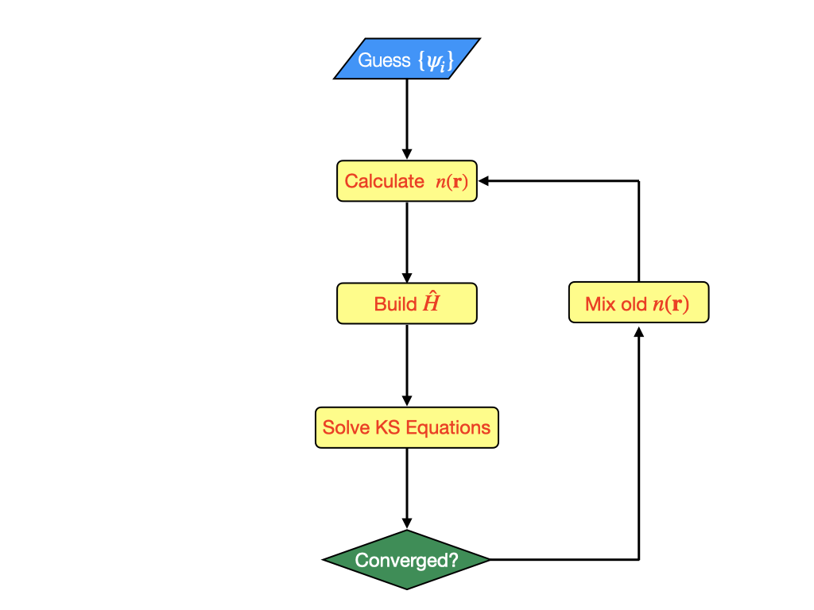
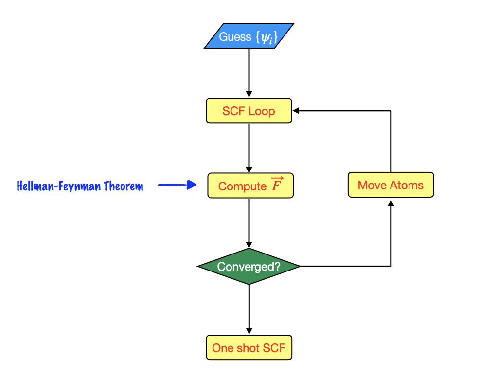
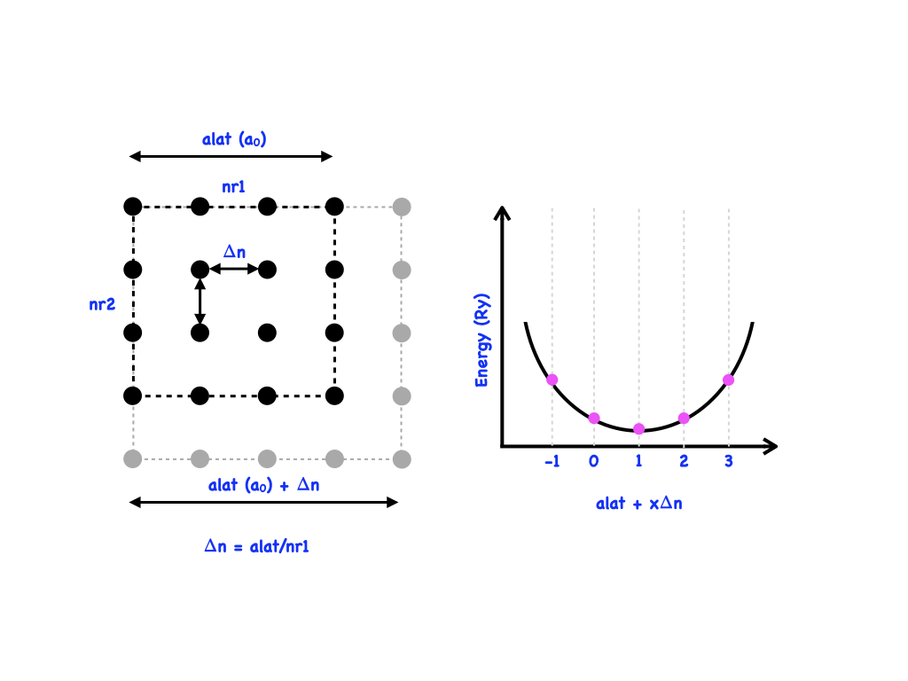

# New pw.x keywords in this Lecture

| <b>Command</b>           | <b>Key Options</b>      | <b>Description</b>                                                                                                       |
| ------------------------ | ----------------------- | ------------------------------------------------------------------------------------------------------------------------ |
| <code>calculation</code> | <code>"relax"           | Start a geometry optimisation calculation in quantum espresso                                                            |
|                          | <code>"vc-relax"</code> | Start a variable cell optimisation calculation in quantum espresso                                                       |
| <code>mixing_beta</code> | <code>0.7</code>        | Alter the fraction of the previous density mixed into the current step, can help with convergence.                       |
| <code>&IONS</code>       |                         | Input card required when performing geometry optimisation                                                                |
| <code>&KPOINTS</code>    | <code>{gamma}</code>    | Special $\Gamma$-point only k-point sampling, which can massively speed up calculations since all wavefunctions are real |

# Forces and Stress in (Periodic) DFT Calculations

## Reminder SCF Loop

## Workflow for Geometry optimisation

# Examples in this session

This session aims to build upon our working knowledge of the <code>pw.x</code> package by introducing the concepts and keywords associated with structural optimisation.

Specifically, we will consider three different cases
- <b>CO Molecule</b>
	- Changes that we must make to the <code>pw.x</code> input file to perform geometry optimisation.
	- Where to check for convergence in the output file
- <b>Al(001) surface slab</b>
	- The difference between molecular (aperiodic) and crystal (periodic) relaxation
- <b>As Crystal</b>
	- Changes that we must make to optimise the lattice vectors
	- Crystal optimisation subject to external pressure

As in the previous sessions we will make use of three different terminal windows. Two logged into the SCARF cluster and one that we will leave on the diamond linux environment to visualise the structures and results

Start by logging into SCARF and moving to the example to your personal work directory:

```bash
$ ssh myfedid@ui1.scarf.ac.uk
$ cd /work4/dls/shared/JoshuaElliott
$ cd Quantum-Espresso-Introduction/Examples/05_Geometry_Optimisation
$ ls
LatticeOpt  Relax  VC_Relax
$ cd Relax
```

The first example that we will work through is the basic relaxation of a CO molecule in a vacuum
# Example 1: CO Molecule Relaxation

We can use the atomic simulation environment to check the input geometry in a separate terminal window:

```
$ scp myfedid@ui1.scarf.rl.ac.uk:/work4/dls/JoshuaElliott/Quantum-Espresso-Introduction/Examples/05_Geometry_Optimisation/Relax/CO.relax.pwi .
$ ase gui CO.relax.pwi
```

Once we're happy with the geometry, we can look at the changes to the input file

```
$ cat CO.relax.pwi
&CONTROL
  calculation  = "relax"
  prefix       = "CO",
  pseudo_dir   = "./pseudopotentials"
  outdir       = "./TMP"
/
  
&SYSTEM
  ibrav     = 0,
  nat       = 2,
  ntyp      = 2,
  ecutwfc   = 40.D0,
  ecutrho   = 400.D0,
/
  
&ELECTRONS
  conv_thr    = 1.D-7,
  mixing_beta = 0.7D0,
/
  
&IONS
/
  
CELL_PARAMETERS bohr
12.0  0.0  0.0
 0.0 12.0  0.0
 0.0  0.0 12.0
  
ATOMIC_SPECIES
O  1.00  O.pz-rrkjus.UPF
C  1.00  C.pz-rrkjus.UPF
  
ATOMIC_POSITIONS {bohr}
C  2.256  0.0  0.0
O  0.000  0.0  0.0  0 0 0
  
K_POINTS {Gamma}
```

There are two parts of the input file that we should take note of that enable the optimisation of the geometry:

Firstly the choice of the calculation in the `&CONTROL` name list which is set to `relax`

```
&CONTROL
   calculation  = "relax"
/
```

Second, as we saw in one of the previous sections, is simply the inclusion of the `&IONS` name list

```
&IONS
/
```

We can now request some compute resources and run the example:

```bash
$ salloc -n 1 -C amd
salloc: Granted job allocation 2236277
salloc: Waiting for resource configuration
salloc: Nodes cn035 are ready for job

$ module load contrib/dls-spectroscopy/quantum-espresso/7.3.1-GCC-12.2.0
$ export OMP_NUM_THREADS=1

$ mpirun -np 1 pw.x -inp CO.relax.pwi | tee CO.relax.pwo

...
...
...
   This run was terminated on:  14:29:54  22Mar2024            
  
=------------------------------------------------------------------------------=
   JOB DONE.
=------------------------------------------------------------------------------=
```

## How is the output modified, what should we look for

If we look through the output, we can see the sequential SCF cycles, updates to the geometry and convergence:

```
     iteration # 15     ecut=    40.00 Ry     beta= 0.70
     Davidson diagonalization with overlap
     ethr =  1.39E-09,  avg # of iterations =  5.0

     total cpu time spent up to now is        8.7 secs

     End of self-consistent calculation

          k = 0.0000 0.0000 0.0000 (  3625 PWs)   bands (ev):

   -27.8131 -13.3732 -10.8394 -10.8394  -8.5092

     highest occupied level (ev):    -8.5092

!    total energy              =     -43.12742185 Ry
     estimated scf accuracy    <       0.00000002 Ry

     The total energy is the sum of the following terms:
     one-electron contribution =     -64.89989578 Ry
     hartree contribution      =      33.60781619 Ry
     xc contribution           =      -9.77954256 Ry
     ewald contribution        =      -2.05579971 Ry

     convergence has been achieved in  15 iterations

     Forces acting on atoms (cartesian axes, Ry/au):

     atom    1 type  2   force =    -0.23445175    0.00000000    0.00000000
     atom    2 type  1   force =     0.23445175    0.00000000    0.00000000

     Total force =     0.234452     Total SCF correction =     0.000071

     BFGS Geometry Optimization
     Energy error            =      0.0E+00 Ry
     Gradient error          =      2.3E-01 Ry/Bohr

     number of scf cycles    =   1
     number of bfgs steps    =   0

     energy             new  =     -43.1274218520 Ry

     new trust radius        =       0.2344517536 bohr
     new conv_thr            =       0.0000001000 Ry


ATOMIC_POSITIONS (bohr)
C                2.0215482464        0.0000000000        0.0000000000
O                0.0000000000        0.0000000000        0.0000000000    0   0   0
```

The final electronic properties and geometric configuration are recalculated and printed at the end of the file if the optimisation was successful:

```
     End of self-consistent calculation

          k = 0.0000 0.0000 0.0000 (  3625 PWs)   bands (ev):

   -28.7698 -13.3577 -11.3947 -11.3947  -8.3776

     highest occupied level (ev):    -8.3776

!    total energy              =     -43.14266546 Ry
     estimated scf accuracy    <          2.0E-10 Ry

     The total energy is the sum of the following terms:
     one-electron contribution =     -66.90212816 Ry
     hartree contribution      =      34.54324718 Ry
     xc contribution           =      -9.89386437 Ry
     ewald contribution        =      -0.88992011 Ry

     convergence has been achieved in   8 iterations

     Forces acting on atoms (cartesian axes, Ry/au):

     atom    1 type  2   force =    -0.00008577    0.00000000    0.00000000
     atom    2 type  1   force =     0.00008577    0.00000000    0.00000000

     Total force =     0.000086     Total SCF correction =     0.000014
     SCF correction compared to forces is large: reduce conv_thr to get better values
     Energy error            =      6.7E-06 Ry
     Gradient error          =      8.6E-05 Ry/Bohr

     bfgs converged in   5 scf cycles and   3 bfgs steps
     (criteria: energy <  1.0E-04 Ry, force <  1.0E-03 Ry/Bohr)

     End of BFGS Geometry Optimization

     Final energy             =     -43.1426654580 Ry

     File ./TMP/CO.bfgs deleted, as requested
Begin final coordinates

ATOMIC_POSITIONS (bohr)
C                2.1355792533        0.0000000000        0.0000000000
O                0.0000000000        0.0000000000        0.0000000000    0   0   0
End final coordinates
```

We can also check the progression of the total energy using the `grep` command

```
$ grep ! CO.relax.pwo
!    total energy              =     -43.12742185 Ry
!    total energy              =     -43.12431778 Ry
!    total energy              =     -43.14255558 Ry
!    total energy              =     -43.14265873 Ry
!    total energy              =     -43.14266546 Ry
```

Finally, we can secure copy the output to our local machine and check that the geometric progression is sensible using the atomic simulation environment

```
$ scp myfedid@ui1.scarf.rl.ac.uk:/work4/dls/JoshuaElliott/Quantum-Espresso-Introduction/Examples/05_Geometry_Optimisation/Relax/CO.relax.pwo .
$ ase gui CO.relax.pwo
```

In this case, since the system is a diatomic there is not much interesting to see. However, ASE also automatically extracts and plots the total energy as a function of the optimisation coordinate which can provide a visual check of the convergence.

It is also possible to extract and plot other information from the output file, further details can be found here: https://wiki.fysik.dtu.dk/ase/ase/gui/tools.html#graphs
# Example 2 Al(001) Surface Relaxation Example

The process is the same for optimising a periodic structure. In this example, we will see how to optimise the geometry of a surface using a slab model.

To construct a slab, we have to cut the correct surface from the bulk structure and add a vacuum to the cell. We must be careful to ensure that there are sufficient layers in the slab to converge the bulk and surface properties. If there is not an inversion centre within the system, dipole corrections may also be necessary.

We can check the (not-converged) slab model of the Al(001) surface:
```
$ scp myfedid@ui1.scarf.rl.ac.uk:/work4/dls/JoshuaElliott/Quantum-Espresso-Introduction/Examples/05_Geometry_Optimisation/Relax/Al_001.relax.pwi .
$ ase gui Al_001.relax.pwi
```

Rotating we should see that the slab contains seven layers with a 10.545 Å vacuum separation between periodically repeated images.

Lets check the input file and run the optimisation:

```
$ cat Al_001.relax.pwi
&CONTROL
  calculation = "relax",
  pseudo_dir  = "./pseudopotentials"
  prefix      = "Al"
  outdir      = "./TMP"
/
  
&SYSTEM
  ibrav       = 6,
  celldm(1)   = 5.3033D0,
  celldm(3)   = 8.D0,
  nat         = 7,
  ntyp        = 1,
  ecutwfc     = 60.D0,
  occupations = "smearing",
  smearing    = "marzari-vanderbilt",
  degauss     = 0.05D0,
/
  
&ELECTRONS
  conv_thr    = 1.D-6,
  mixing_beta = 0.3D0,
/
  
&IONS
!  bfgs_ndim         = 3,
/
  
ATOMIC_SPECIES
Al  1.0  Al.pz-vbc.UPF
  
ATOMIC_POSITIONS alat
Al   0.5000000      0.5000000     -2.121320
Al   0.0000000      0.0000000     -1.414213
Al   0.5000000      0.5000000     -0.707107
Al   0.0000000      0.0000000      0.000000
Al   0.5000000      0.5000000      0.707107
Al   0.0000000      0.0000000      1.414213
Al   0.5000000      0.5000000      2.121320
  
K_POINTS automatic
 3 3 1 0 0 0
```

We can run the example in the same way

```bash
mpirun -np 1 pw.x Al_001.relax.pwi | tee Al_001.relax.pwo
```

Once the calculation is complete check the output to make sure the optimisation is completed then let's download and check the structure:
## Visualise output

```
$ scp myfedid@ui1.scarf.rl.ac.uk:/work4/dls/JoshuaElliott/Quantum-Espresso-Introduction/Examples/05_Geometry_Optimisation/Relax/Al_001.relax.pwo .
$ ase gui Al_001.relax.pwo
```
# Example 3 Relaxing the lattice parameter manually

The optimisation of the geometry and the lattice parameters can be conceptually much more difficult. This is because we have to take into account the discretisation of the space inside the unit cell


For simplicity, we will look at an isotropic system (bulk As), so the number of grid points along each direction will be the same since the length of the lattice vectors is the same.

The input SCF calculation for Bulk As can be found in the folder:
```
$ cd /work4/dls/myfedid/Quantum-Espresso-Introduction/Examples/05_Geometry_Optimisation/LatticeOpt
$ ls 
As.3.710.pwi  As.3.772.pwi  As.3.833.pwi  As.3.895.pwi  As.3.957.pwi  As.4.019.pwi  As.4.081.pwi  As.scf.pwi  pseudopotentials
```

Lets take a quick look at the SCF input file and then run the example (feel free to copy the input and check the structure with atomic simulation environment):

```
$ cat As.scf.pwi
 &CONTROL
   calculation   =   "relax",
   restart_mode  = 'from_scratch',
   outdir        = './TMP',
   pseudo_dir    = './pseudopotentials',
   etot_conv_thr = 1.0E-5,
   forc_conv_thr = 1.0D-4,
 /
  
 &SYSTEM
   ibrav        = 0
   A            = 3.70971016
   nat          =  2
   ntyp         =  1
   ecutwfc      =  60.0
   ecutrho      =  600.0
   nbnd         =  9
   occupations  =  'smearing'
   smearing     =  'mv'
   degauss      =  0.005
 /
  
 &ELECTRONS
   conv_thr     =  1.0d-7  ,
 /
  
 &IONS
 /
  
 &CELL
   cell_dynamics = 'bfgs' ,
   press         = 0.00 ,
 /
  
CELL_PARAMETERS alat
 0.58012956  0.00000000  0.81452422
-0.29006459  0.50240689  0.81452422
-0.29006459 -0.50240689  0.81452422
  
ATOMIC_SPECIES
As   74.90000  As.pz-bhs.UPF
  
ATOMIC_POSITIONS crystal
As    0.290010       0.290010       0.290010
As   -0.290010      -0.290010      -0.290010
  
K_POINTS automatic
  4 4 4   1 1 1
$
$ mpirun -np 1 pw.x -inp As.scf.pwi | tee As.scf.pwo
```

To understand by how much we can increase or decrease the lattice constant we have to find out the size of the dense grid used during the calculation. By default, this depends on the kinetic energy cutoff on the plane waves basis set.

We can use the command:

```
$ grep "Dense  grid:" As.scf.pwo
     Dense  grid:     4159 G-vectors     FFT dimensions: (  60,  60,  60)
```

To compute the energy as a function of the lattice parameter on a consistent grid we must expand the cell in multiples of the grid spacing, perform a geometry relaxation, and manually set the number of grid points within the input file:

In this example, $$\Delta S = \frac{3.70971016}{60}=0.06182850267\ \mathrm{Å}$$ We can create input files with the following parameters

```
   A            = 3.70971016

   nr1  = 60, nr2  = 60, nr3  = 60
   nr1s = 60, nr2s = 60, nr3s = 60

   A            = 3.771538662666667

   nr1  = 61, nr2  = 61, nr3  = 61
   nr1s = 61, nr2s = 61, nr3s = 61
   
   A            = 3.8333671653333337
   
   nr1  = 62, nr2  = 62, nr3  = 62
   nr1s = 62, nr2s = 62, nr3s = 62

   A            = 3.8951956680000004
   
   nr1  = 63, nr2  = 63, nr3  = 63
   nr1s = 63, nr2s = 63, nr3s = 63

   A            = 3.9570241706666667
   
   nr1  = 64, nr2  = 64, nr3  = 64
   nr1s = 64, nr2s = 64, nr3s = 64

   A            = 4.018852673333334
   
   nr1  = 65, nr2  = 65, nr3  = 65
   nr1s = 65, nr2s = 65, nr3s = 65

   A            = 4.080681176000001
   
   nr1  = 66, nr2  = 66, nr3  = 66
   nr1s = 66, nr2s = 66, nr3s = 66
  
```

We can run each of these examples and collect the total energies:

```bash
$ for a in As.*.pwo; do grep ! $a /dev/null | tail -n 1; done
As.3.710.pwo:!    total energy              =     -25.50213841 Ry
As.3.772.pwo:!    total energy              =     -25.50711430 Ry
As.3.833.pwo:!    total energy              =     -25.51108581 Ry
As.3.895.pwo:!    total energy              =     -25.51057633 Ry
As.3.957.pwo:!    total energy              =     -25.50726375 Ry
As.4.019.pwo:!    total energy              =     -25.50149003 Ry
As.4.081.pwo:!    total energy              =     -25.49358205 Ry
As.scf.pwo:!    total energy              =     -25.45147653 Ry
```

We will now fit a quadratic function to the data to determine the location of the minima. 

```bash
$ cat energy_data.dat
3.710     -25.50213841 Ry
3.772     -25.50711430 Ry
3.833     -25.51108581 Ry
3.895     -25.51057633 Ry
3.957     -25.50726375 Ry
```

Fit this data however you like, in this example we will continue to use gnuplot:

```gnuplot
gnuplot> f(x) = a*x**2 + b*x + c
gnuplot> fit f(x) 'energy_data.dat' u 1:2 via a,b,c
...
...
...
Final set of parameters            Asymptotic Standard Error
=======================            ==========================
a               = 0.36945          +/- 0.01474      (3.99%)
b               = -2.85482         +/- 0.1149       (4.023%)
c               = -19.9958         +/- 0.2235       (1.118%)
  
correlation matrix of the fit parameters:
                a      b      c      
a               1.000 
b              -1.000  1.000 
c               1.000 -1.000  1.000
gnuplot>
gnuplot>
gnuplot>p f(x) w l lw 3, 'new_energy.dat' w l lw 3
```

Let us compute the location of the minima, $$ a = \frac{2.85482}{2\times0.36945} = 3.864\ \mathrm{Å} $$

# Example 4 Relaxing the lattice with variable-cell optimisation

Quantum ESPRESSO also has an automatic procedure for optimisation of the lattice parameters: Variable Cell Optimisation. This can be activated by switching the `calculation` key word to `vc-relax` and adding the `&CELL` card. It's worth noting that the `vc-relax` option does not change the size of the grid during optimisation, but does reinitialise a new grid once the optimisation is complete and perform a final single-point step.

Let's setup an example to carry out `vc-relax`:

```
$ cd /work4/dls/myfedid/Quantum-Espresso-Introduction/Examples/05_Geometry_Optimisation/VC_Relax
$ cp /work4/dls/myfedid/Quantum-Espresso-Introduction/Examples/03_Introduction_to_PW/silicon.pwi .
```

We can modify the input file so that:

```
&CONTROL
   calculation = 'vc-relax' ! The type of job requested
   prefix      = 'si' ! The name of the files created
   outdir      = './OUT' ! Where metadata is stored
   pseudo_dir   ='/work4/dls/shared/pslibrary_pbe'  ! The location of the pseudopotentials
   verbosity   = 'high' ! How detailed is the output from the code
   etot_conv_thr = 1.0E-5, 
   forc_conv_thr = 1.0D-4,
/

&SYSTEM
   ibrav     =  0    ! index of the bravais lattice
   celldm(1) = 10.90 ! Lattice parameter in (Bohr Radius)
   nat       =  2    ! Number of atoms
   ntyp      =  1    ! Number of different Atomic types
   ecutwfc   = 40    ! Energy cutoff applied to basis set
   nspin     =  1    ! Spin polarization or non-collinear magnetism
/

&ELECTRONS
/

&IONS
/

&CELL
/

ATOMIC_SPECIES
Si 28.086 Si.pbe-nl-rrkjus_gipaw.UPF

ATOMIC_POSITIONS {alat}
Si 0.00 0.00 0.00
Si 0.25 0.25 0.25

K_POINTS {automatic}
3 3 3 0 0 0

CELL_PARAMETERS {alat}
 -0.50 0.00 0.50
  0.00 0.50 0.50
 -0.50 0.50 0.00
$ mpirun -np 1 pw.x -inp silicon.pwi | tee silicon.pwo
```

Copy the output file to your local machine and visualise the optimisation with atomic simulation environment:

```
$ scp myfedid@ui1.scarf.rl.ac.uk:/work4/dls/JoshuaElliott/Quantum-Espresso-Introduction/Examples/05_Geometry_Optimisation/VC_Relax/silicon.pwo .
$ ase gui silicon.pwo
```
## Same example with external pressure

It is also possible to apply an external pressure by adding the `press` keyword to the `&CELL` namelist:

```
&CONTROL
   calculation = 'vc-relax' ! The type of job requested
   prefix      = 'si' ! The name of the files created
   outdir      = './OUT' ! Where metadata is stored
   pseudo_dir   ='/work4/dls/shared/pslibrary_pbe'  ! The location of the pseudopotentials
   verbosity   = 'high' ! How detailed is the output from the code
   etot_conv_thr = 1.0E-5, 
   forc_conv_thr = 1.0D-4,
/

&SYSTEM
   ibrav     =  0    ! index of the bravais lattice
   celldm(1) = 10.90 ! Lattice parameter in (Bohr Radius)
   nat       =  2    ! Number of atoms
   ntyp      =  1    ! Number of different Atomic types
   ecutwfc   = 40    ! Energy cutoff applied to basis set
   nspin     =  1    ! Spin polarization or non-collinear magnetism
/

&ELECTRONS
/

&IONS
/

&CELL
   press = 500
/

ATOMIC_SPECIES
Si 28.086 Si.pbe-nl-rrkjus_gipaw.UPF

ATOMIC_POSITIONS {alat}
Si 0.00 0.00 0.00
Si 0.25 0.25 0.25

K_POINTS {automatic}
3 3 3 0 0 0

CELL_PARAMETERS {alat}
 -0.50 0.00 0.50
  0.00 0.50 0.50
 -0.50 0.50 0.00
$ mpirun -np 1 pw.x -inp silicon.pwi | tee silicon.pwo
```
