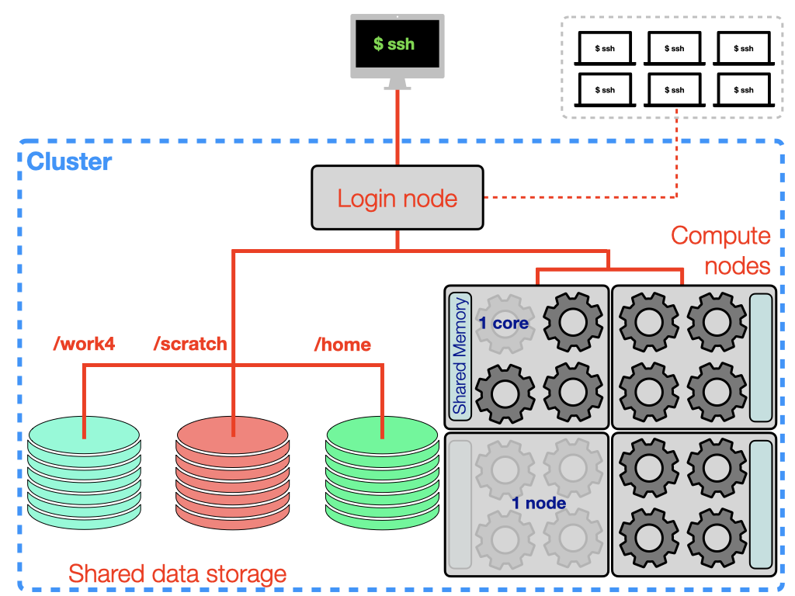

# New Commands in this lecture

| Command | Key Options | Description |
| ------- | ----------- | ----------- |
| <code>ssh</code>     | <code>-X</code> <code>-Y</code>                          | Access a remote machine |
| <code>scp</code>     |                                                          | Copy from a remote machine |
| <code>module</code>  | <code>avail</code> <code>spider</code>                   | Search for availavble software |
|                      | <code>load</code> <code>unload</code> <code>purge</code> | load or unload software |
| <code>sbatch</code>  |                                                          | Submit a job script to the scheduler |
| <code>squeue</code>  | <code>-u</code>                                          | Print the queue status |
| <code>scancel</code> |                                                          | Cancel a queued/running job |
|                      |                                                          |                        |
| <code>mpirun</code>  | <code>-np</code>                                         | Execute a command in parallel |

# Getting set up on SCARF

You should apply for access to SCARF [here](https://www.scarf.rl.ac.uk/registration.html).

### Connecting to scarf

Open up a terminal window and use the new command <code>ssh</code> to initiate the connection

    $ ssh fedid@ui1.scarf.rl.ac.uk
    fedid@ui1.scarf.rl.ac.uks password:

Enter your password (note that the cursor does not move as you type) and you should be logged in.
If this is the first time you have logged into scarf, you may also be asked something like:

    The authenticity of host 'ui1.scarf.rl.ac.uk (130.246.142.130)' cant be established.
    ECDSA key fingerprint is 
    ECDSA key fingerprint is 
    Are you sure you want to continue connecting (yes/no)?

You can type <code>yes</code> to add scarf to your list of known_hosts which are stored at <code>~/.ssh/known_hosts</code>

# The Job Script (Line by Line)

    #!/bin/bash
    #SBATCH -p scarf
    #SBATCH -C amd
    #SBATCH --nodes=2 --ntasks-per-node=32 
    #SBATCH -t 560
    #SBATCH -o job_%J.log
    #SBATCH -e job_%J.err
    
    export OMP_NUM_THREADS=1
    module load contrib/dls-spectroscopy/quantum-espresso/6.5-intel-18.0.3

    mpirun -np ${SLURM_NTASKS} pw.x -inp 'diamond.pwi' > 'diamond.pwo'

We have already seen the first line of the job file in the previous lecture.

    #!/bin/bash

This is the [shebang](https://en.wikipedia.org/wiki/Shebang_(Unix)) and tells the computer how to exectue the script.
In this case we are asking for <code>/bin/bash</code>

In the next few lines we will see the commands that provide instructions to the SLURM job scheduler. These lines all start with the command <code>#SBATCH</code>

    #SBATCH -p scarf

The <code>-p</code> option instructs the scheduler on the queue/partitiono we should submit to. 
There is a [list of available partitions](https://www.scarf.rl.ac.uk/jobs.html#choosing-a-sub-section-of-the-cluster) on the SCARF help pages. 
For our work at Diamond we will mostly be performing small tests in the the <code>devel</code> partition and running calculations in the <code>scarf</code> partition. 

    #SBATCH -C amd

SCARF is a heterogenous cluster, which means that it is built from many different types of compute nodes.
The <code>-C</code> option allows us to pick which type of node we run our simulations on.
This can be helpful in trying to configure our job size, for example in the above example we have requested to use the [SCARFs AMD nodes](https://www.scarf.rl.ac.uk/user-guides/amd.html#running-jobs-on-amd-nodes).
The AMD nodes come with 32-core-per-node, so we know that we must configure our job to run in mutiples of 32 processes. 

    #SBATCH --nodes=2 --ntasks-per-node=32 

Here we are requesting resources. 
The option <code>--nodes</code> specifies how many nodes we would like.
The option <code>--ntasks-per-node</code> specifies how many tasks/processes we would like on each node.
In the example, we are asking for 2 AMD nodes, and 32 tasks/processes for each node.
This means in total our job will split work across 64 cores, and each core will have an associated task.

    #SBATCH -t 560

The <code>-t</code> is the total amount of time we are requesting for the job.
We should set this time making sure that our calculation will finish and adhering to the maximum queue lengths (<code>devel</code> = 12 Hours; <code>scarf</code>7 days).  
The job total time can be set with different formats, generally is easiest to stick to one. 
Acceptable time formats include  "minutes",  "minutes:seconds", "hours:minutes:seconds", "days-hours", "days-hours:minutes" and "days-hours:minutes:seconds".
In this example <code>560</code> minutes are requested, which is equivalently:

    #SBATCH -t 560
    #SBATCH -t 560:00
    #SBATCH -t 9:20:00
    #SBATCH -t 0-9:20
    #SBATCH -t 0-9:20:00

The next two lines specify the names of two files created to handle text output from the job.
This is not necessarily output from the code we use to perform the simulation.

    #SBATCH -o job_%J.log
    #SBATCH -e job_%J.err

The <code>-o</code> option denotes the name given to the file created for standard output.
The <code>-e</code> option denotes the name given to the file created for any error messages.
The <code>%J</code> is an environment variable that stores the job indentification number. 
Using this option helps to match these output files to a specific job.

There are several further options that can be added to this section of the job submission script.
These are all options associated with the <code>sbatch</code> command, you can look them up using the manual: <code>man sbatch</code>
    
The last part of this input file deals with the actual execution of the software we would like to run. 

First we use the export command to set the number of threads for each task. 
Threading is another way of performing parallel calculations, for now we will not worry about threading.

    export OMP_NUM_THREADS=1

Setting <code>OMP_NUM_THREADS=1</code> will lead to the job only having parallel tasks

    module load contrib/dls-spectroscopy/quantum-espresso/6.5-intel-18.0.3

We have seen the <code>module load</code> command, if we include this in the job script we will make sure that we keep a record of the version of the software we used to perform the calculation.
    
    mpirun -np ${SLURM_NTASKS} pw.x -inp 'diamond.pwi' > 'diamond.pwo'

Finally the <code>mpirun</code> command is used to execute the parallel job.
Here <code>pw.x</code> is the part of the Quantum Espresso software suite that performs the DFT calculation. 
It also has the associated option <code>-inp</code> which specifies where to read input from.
Moreover, we use a <code>></code> to redirect the output into a new file <code>'diamond.pwo'</code>
The variable <code>${SLURM_NTASKS}</code> is an environment variable that automatically contains the correct number of tasks we want to run with.
