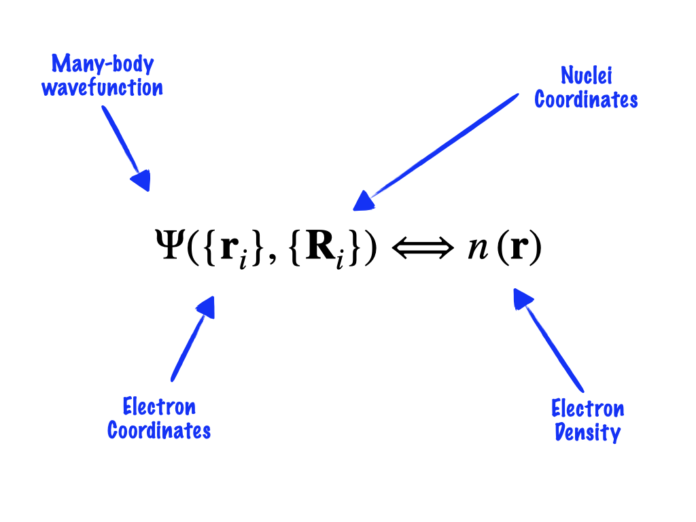
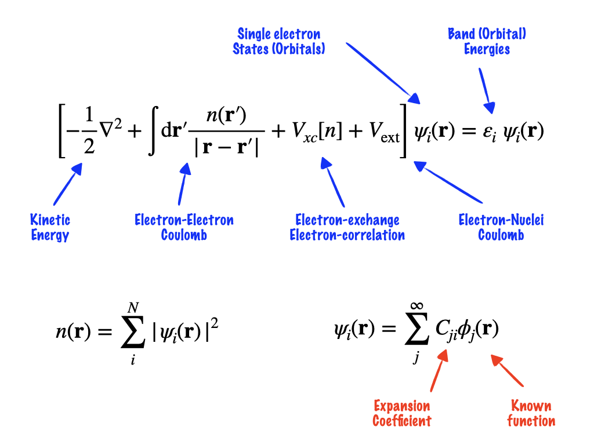
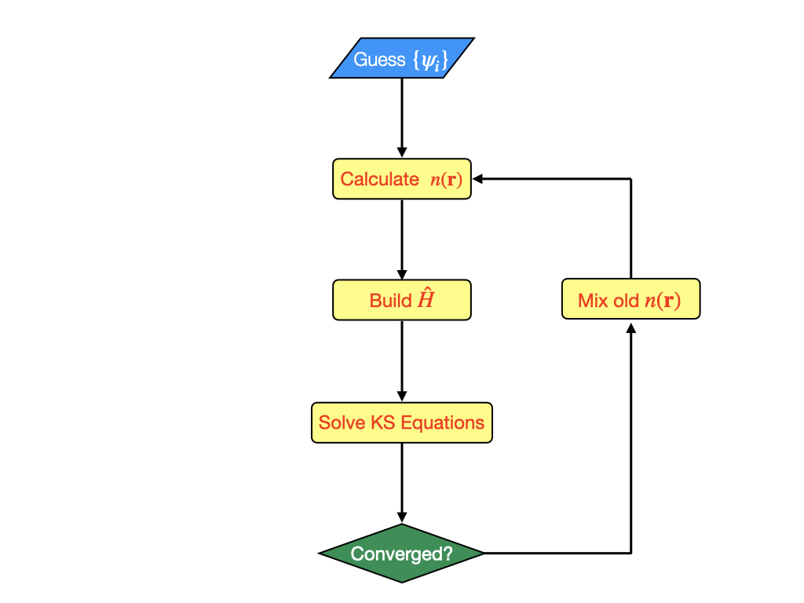
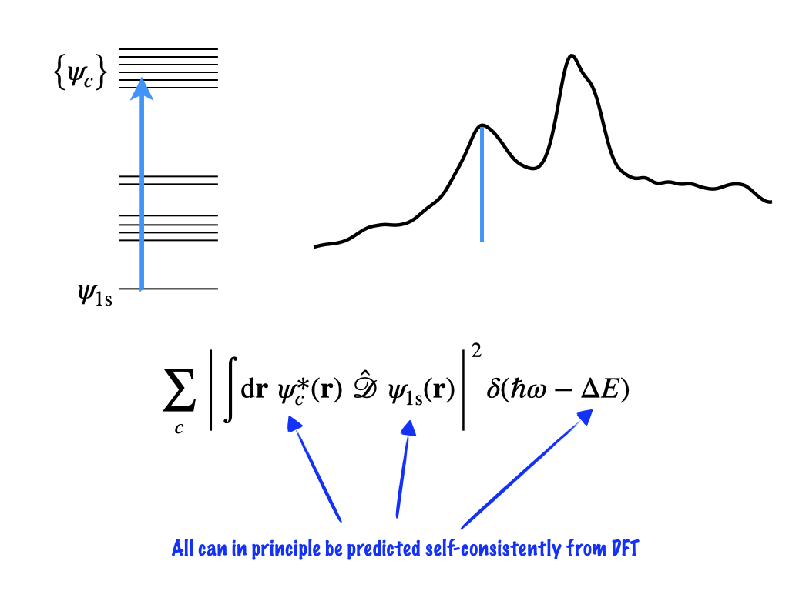

# Getting Started with <code>pw.x</code>

## New commands

| Command | Key Options | Description |
| ------- | ----------- | ----------- |
| <b>QE</b> |  |  |
<code>pw.x</code> | <code>-inp</code> <code>-npools</code> | Main executable for DFT in Quantum ESPRESSO |
| <b>Other</b> |  |
| <code>module</code> | <code>load</code> | load a particular module to the current environment |
| <code>export</code> | | export an environment variable
| <code>mpirun</code> | <code>-np</code> | Run a job with parallel processes |
| <code>tee</code>    |   | Simultaneously print output to terminal and capture to file |

## What is Density Functional Theory, Why Should we use it?

## Introduction to X-Ray Spectroscopy in Quantum ESPRESSO

## The <code>pw.x</code> Input File

Now we can look at the input file, which will be read by the <code>pw.x</code>.
The input file is separated into a set of <code>Namelists</code> that must be presented in
order, followed by a series of <code>Cards</code>, which can be presented in any order.

Essentially the <code>Namelists</code> define the calculation and <code>Cards</code>
define the system we want to calculate.

There are potentially hundreds of individuals key words we might want to use to run our
calculations.
There is a complete overview of the input keywords and possible arguments available
[here](https://www.quantum-espresso.org/Doc/INPUT_PW.html). It is not required to provide
every keyword in the input file. First we will look at the most important ones:

The first <code>Namelist</code> is <code>&CONTROL</code>, which deals with <em>administrative</em>
variables. Quantum ESPRESSO is programmed in FORTRAN, so <code>!</code> can be used to
insert a comment.

    &CONTROL
       calculation = '' ! The type of job requested
       prefix      = '' ! The name of the files created
       outdir      = '' ! Where metadata is stored
       psuedodir   = '' ! The location of the pseudopotentials
       verbosity   = '' ! How detailed is the output from the code
    /

The second <code>Namelist</code> is the <code>&SYSTEM</code>, which describes the material being
calculated.

    &SYSTEM
       ibrav     = ! index of the bravais lattice
       celldm(1) = ! Lattice parameter in (Bohr Radius)
       nat       = ! Number of atoms
       ntyp      = ! Number of different Atomic types
       ecutwfc   = ! Energy cutoff applied to basis set
       nspin     = ! Spin polarization or non-collinear magnetism
    /

The third <code>Namelist</code> is <code>&ELECTRONS</code> which introduces keywords that control the
self consistency cycle.
Luckily in the first instance, we do not have to specify anything here, just declare the
<code>Namelist</code>

    &ELECTRONS
    /

For geometry optimisation, there is one further <code>Namelist</code> which controls the
optimisation of the ionic (nuclear) coordinates. Similar to the <code>&ELECTRONS</code>
<code>Namelist</code>, we don't have to provide any parameters at first.

    &IONS
    / 

After these <code>Namelists</code> in this order, we have to provide a set of
<code>Cards</code> that provides details on the system.
These <code>Cards</code> can be given in any order.

The first we will require is the <code>ATOMIC_SPECIES</code> Card.
This is a list of all of the different atom types used in the calculation.
Note that the same Atom can be given two different labels to distinguish between different
sites in a crystal. This is useful for instance in defining magnetically coupled elements
in anti-ferromagnetic materials.

The number of specicies listed in the <code>ATOMIC_SPECIES</code> <code>Card</code> should
be equal to <code>ntyp</code> set in the <code>&SYSTEM</code> <code>Namelist</code>

    ATOMIC_SPECIES
    label1 atomic_mass pseudopotential
    label2 atomic_mass pseudopotential

We also have to provide the coordinates of the atoms in the system.
These can be given to <code>pw.x</code> in xyz format in units of Angstrom, Bohr radius
and as a fraction of the lattice parameter.

    ATOMIC_POSITIONS {Unit}
    label1 x1 y1 z1
    label1 x2 y2 z2
    label1 x3 y3 z3
    label2 x4 y4 z4

If we do not use a prescribed Bravais lattice through the <code>ibrav</code> keyword in
the <code>&SYSTEM</code> <code>Namelist</code>, then we must provide details on the unit
cell. Similar to the atomic coordinates, the cell can be specified with units Angstrom,
Bohr radius and as a fraction of the lattice constant.

    CELL_PARAMETERS {Unit}
    a1 a2 a3
    b1 b2 b3
    c1 c2 c3

Lastly, we must describe the sampling of the reciprocal lattice. 
This is done using the <code>K_POINTS</code> <code>Card</code>.
For the standard DFT calculations we will do, it is best to use an automatically generated
Gamma centered grid

    K_POINTS {Automatic}
    k1 k2 k3 0 0 0

## Running <code>pw.x</code>

Lets put together an input file from scratch and run <code>pw.x</code> live.

First we can login to SCARF and navigate to the directory we created for our work last time

    $ ssh myfedidi@ui1.scarf.rl.ac.uk
    $ cd myfedid

Next we can create a directory for the first example we will run

    $ mkdir espresso_example
    $ espresso_example

Now we can begin to write the input file, I will use <code>nano</code>, which is a basic commandline text editor

    $ nano silicon.pwi

    &CONTROL
       calculation = 'scf' ! The type of job requested
       prefix      = 'si' ! The name of the files created
       outdir      = './OUT' ! Where metadata is stored
       pseudo_dir   = '/work4/dls/shared/pslibrary_pbe' ! The location of the pseudopotentials
       verbosity   = 'high' ! How detailed is the output from the code
    /
    
    &SYSTEM
       ibrav     =  0    ! index of the bravais lattice
       celldm(1) = 10.40 ! Lattice parameter in (Bohr Radius)
       nat       =  2    ! Number of atoms
       ntyp      =  1    ! Number of different Atomic types
       ecutwfc   = 40    ! Energy cutoff applied to basis set
       nspin     =  1    ! Spin polarization or non-collinear magnetism
    /
    
    &ELECTRONS
    /
    
    ATOMIC_SPECIES
    Si 28.086 Si.pbe-nl-rrkjus_gipaw.UPF
    
    ATOMIC_POSITIONS {alat}
    Si 0.00 0.00 0.00
    Si 0.25 0.25 0.25
    
    K_POINTS {automatic}
    3 3 3 0 0 0
    
    CELL_PARAMETERS {alat}
     -0.50 0.00 0.50
      0.00 0.50 0.50
     -0.50 0.50 0.00

To exit you can use the key combination <code>CTRL+X</code>

Some thing to note before we move on with running the calculation: There are pseudopotential files for most elements in the directory <code>/work4/shared/</code>, so this can be set for the keyword <code>pseudo_dir</code>. To find the name of the pseudopotential for the element you require you can use <code>ls</code> on this directory.

As this is a very small, and very short calculation we are going to run it live (I do not recommend doing this under any other circumstances).

    $ module load contrib/dls-spectroscopy/quantum-espresso/6.5-intel-18.0.3
    $ export OMP_NUM_THREADS=4
    $ mpirun -np 4 pw.x -inp silicon.pwi | tee silicon.pwo
    ....
    =------------------------------------------------------------------------------=
       JOB DONE.
    =------------------------------------------------------------------------------=

First we load the relevant module to have the quantum ESPRESSO executable files in our PATH.
Next to make sure that we localise the small job we set the environment variable <code>OMP_NUM_THREADS</code> to 1
Finally, we launch the <code>pw.x</code> code using the <code>mpirun</code> command. We ask for 4 processes using the option <code>-np</code>.

The <code>pw.x</code> requires and input file for execution, we use the flag <code>-inp</code> to provide one.
Finally we use the <code>tee</code> command to capture the output in the new file <code>silicon.pwo</code>.  <code>tee</code> is particularly useful in this case because it also prints the output to the terminal, unlike a regular redirect.

These commands should be at least a little bit familiar from the job script last week, even if we didnt go over them explicitly.

## The <code>pw.x</code> Output File

We have seen from the Silicon example, a lot of things are printed during the calculation.
We already saw from the first lecture that this can be very difficult to parse and so we
can use commands like <code>grep</code> and <code>awk</code> to extract the data we want.

In fact, that command that we used will work directly on the output we just created:

    grep 'scf accuracy' silicon.pwo | tail -n 14 | awk '{printf("%4d %15.5e\n",  NR, $5*13.605662285137)}' | tee finalScf.dat

Now however, we can begin to look at the contents of the output file and start to look at
everything that is being printed.

The first section is the File header. This contains information on the code and the
version you are using, as well as providing some references and helpful hyperlinks

     Program PWSCF v.6.5 starts on 10Oct2022 at 16: 2:44 

     This program is part of the open-source Quantum ESPRESSO suite
     for quantum simulation of materials; please cite
         P. Giannozzi et al., J. Phys.:Condens. Matter 21 395502 (2009);
         P. Giannozzi et al., J. Phys.:Condens. Matter 29 465901 (2017);
          URL http://www.quantum-espresso.org, 
     in publications or presentations arising from this work. More details at
     http://www.quantum-espresso.org/quote

Next the code reports on the compute settings and input file.
This is a good way to check that <code>pw.x</code> has understood what we have asked for.

For instance, in the example you shoud see that it is running in parallel with 4
processors, this makes sence since in our run command we asked for <code>mpirun -np
4</code>.

     Parallel version (MPI), running on     4 processors

     MPI processes distributed on     1 nodes
     R & G space division:  proc/nbgrp/npool/nimage =       4
     Reading input from silicon.pwi

Once the calculation starts the code prints out at each individual iteration the
information about the self-consistency cycles.

At the end of each iteration it reports the <code>total energy</code> and <code>scf
accuracy</code>. These are the two main critera used to determine convergence.

     iteration #  1     ecut=    40.00 Ry     beta= 0.70
     Davidson diagonalization with overlap
     ethr =  1.00E-02,  avg # of iterations =  2.0

     Threshold (ethr) on eigenvalues was too large:
     Diagonalizing with lowered threshold

     Davidson diagonalization with overlap
     ethr =  8.51E-04,  avg # of iterations =  1.2

     total cpu time spent up to now is        0.5 secs

     total energy              =     -20.39192174 Ry
     Harris-Foulkes estimate   =     -20.40782868 Ry
     estimated scf accuracy    <       0.06702974 Ry

     iteration #  2     ecut=    40.00 Ry     beta= 0.70
     Davidson diagonalization with overlap
     ethr =  8.38E-04,  avg # of iterations =  1.0

     total cpu time spent up to now is        0.5 secs

     total energy              =     -20.39429182 Ry
     Harris-Foulkes estimate   =     -20.39448746 Ry
     estimated scf accuracy    <       0.00338013 Ry

     iteration #  3     ecut=    40.00 Ry     beta= 0.70
     Davidson diagonalization with overlap
     ethr =  4.23E-05,  avg # of iterations =  2.5

     total cpu time spent up to now is        0.5 secs

     total energy              =     -20.39488490 Ry
     Harris-Foulkes estimate   =     -20.39492567 Ry
     estimated scf accuracy    <       0.00012018 Ry

Once the scf cycles are complete the code then reports information on the electronic
structure it calculated.

This includes things like computed magnetization, computed partial charges on each atom
and the set of <b>k</b>-resolved band energies and their occupations.

Notice that only the valence states are reported, this is because in the calculation the
core states are replaced by pseudopotentials.

          k = 0.0000 0.0000 0.0000 (  1243 PWs)   bands (ev):

    -5.8129   5.8974   5.8974   5.8974

     occupation numbers 
     1.0000   1.0000   1.0000   1.0000

          k =-0.3333 0.3333-0.3333 (  1194 PWs)   bands (ev):

    -4.4843   0.6600   4.9176   4.9176

     occupation numbers 
     1.0000   1.0000   1.0000   1.0000

          k = 0.0000 0.6667 0.0000 (  1218 PWs)   bands (ev):

    -3.9713   0.9127   3.5484   3.5484

     occupation numbers 
     1.0000   1.0000   1.0000   1.0000

          k = 0.6667-0.0000 0.6667 (  1196 PWs)   bands (ev):

    -2.6689  -0.7841   1.6391   3.8425

     occupation numbers 
     1.0000   1.0000   1.0000   1.0000

     highest occupied level (ev):     5.8974

This is typically the information that we want to know about our system. However,
something else we may want to know (and we will need for the next section) is the final
 total energy.

     !    total energy              =     -20.39492696 Ry

Helpfully, the total energy is printed with an <code>!</code>, which makes it very easy to
find with the <code>grep</code> command

    $ grep ! silicon.pwo
    !    total energy              =     -20.39492696 Ry

# Optimization with <code>pw.x</code>

## Basis set optimization

First lets look at the first part of the optimization, which is the optimization of the
basis set.

To understand why we should do this optimisation we can look at what the basis set is

$$ \psi_i(\mathbf{r}) = \sum^\infty C_{ji} \phi_{j}(\mathbf{r}) $$

a representation of the wavefunction $\psi_i$ as an infinite expansion of known functions
$\phi_i$, in our case those known functions are plane waves.
Practically, we cannot achieve an infinite expansion, so we have to truncate the basis
set, we do this by imposing a cutoff on the kinetic energy of the plane waves.

To make sure that we find an accurate solution, in optimal time we must perform a series of calculations that check how a property (the total energy) changes when the sum increases.

We will look at the case of IrO2, we can copy the folder to our working directory

    $ cd
    $ cd myfedid
    $ cp -r /work4/dls/shared/introToScarf02 .
    $ ls -ltrh
    drwxr-xr-x 4 scarf1097 diag 4.0K Oct 11 09:55 introToScarf02
     
    $ cd introToScarf02/iro2_example_planewaves
    $ ls -ltrh
    drwxr-xr-x 2 scarf1097 diag 4.0K Oct 11 09:55 reference_output
    -rw-r--r-- 1 scarf1097 diag  299 Oct 11 09:55 job.sh
    -rw-r--r-- 1 scarf1097 diag  965 Oct 11 09:55 iro2.pwi

    $ cat iro2.pwi
    
    &CONTROL
       calculation      = 'scf'
       title            = 'IrO2 Unit Cell'
       verbosity        = 'high'
       outdir           = 'tmp'
       prefix           = 'iro2'
       pseudo_dir       = '/work4/dls/shared/pslibrary_pbe'
    /
    &SYSTEM
       ecutwfc          = ! This must be converged
       ecutrho          = ! 10.*ecutwfc
       starting_magnetization(1) = 0.0
       starting_magnetization(2) = 0.0
       nspin            = 2
       ntyp             = 2
       nat              = 6
       ibrav            = 6
       celldm(1)        = 8.5888
       celldm(3)        = 0.7018701870187019
       occupations      = 'smearing'
       smearing         = 'mp'
       degauss          = 0.005
    /
    &ELECTRONS
       electron_maxstep = 100
       conv_thr         = 1.D-7 
    /
    
    ATOMIC_SPECIES
     O   15.999 O.pbe-nl-rrkjus_gipaw.UPF 
    Ir  192.217 Ir.pbe-n-rrkjus_gipaw.UPF 
    
    K_POINTS automatic
    2 2 2 0 0 0
    
    ATOMIC_POSITIONS crystal
    Ir 0.0000 0.0000 0.0000
    Ir 0.5000 0.5000 0.5000
     O 0.1916 0.8084 0.5000
     O 0.3084 0.3084 0.0000
     O 0.6916 0.6916 0.0000
     O 0.8084 0.1916 0.5000
    
There are some key differences in this input file from the one that we saw before for Silicon

| Keyword | Description |
| ------- | ----------- |
| title   | Gives the simulation a title in the output file |
| starting_magnetization | When building the initial description, creates atom with spin up (1.0) spin down (-1.0) or no spin orientation (0.0) |
| ecutrho | A similar parameter to <code>ecutwfc</code> for the expansion of the density | 
| nspin   | Tells <code>pw.x</code> to perform a non-spin polarizaed (1), spin polarized (2) or non-collinear (4) calculation |
| occupations | Whether to used fixed (1 or 0) or smeared (non integer) orbital occupations |
| smearing | Method by which to smear orbital occupations |
| degauss | Magnitude of smearing |
| electron_maxstep | Maximum number of scf cycles |
| conv_thr | Tolerance for convergence of scf loop |

### HOMEWORK

Use the job submission script to run the iro2 job. 
To start with use an <code>ecutwfc</code> of 40 Ry and <code>ecutrho</code> of 400 Ry.
Systematically increase the wavefunction cutoff (and density cutoff) from 40 to 120 Ry.
Look at the Total energy in the output file to determine when the calculation is converged.

### Solution

    $ cd reference_output
    ls -ltrh
    total 1.3M
    -rw-r--r-- 1 scarf1097 diag 41K Oct 11 09:55 basis_100.pwo
    -rw-r--r-- 1 scarf1097 diag 41K Oct 11 09:55 basis_110.pwo
    -rw-r--r-- 1 scarf1097 diag 41K Oct 11 09:55 basis_120.pwo
    -rw-r--r-- 1 scarf1097 diag 41K Oct 11 09:55 basis_40.pwo
    -rw-r--r-- 1 scarf1097 diag 41K Oct 11 09:55 basis_50.pwo
    -rw-r--r-- 1 scarf1097 diag 41K Oct 11 09:55 basis_60.pwo
    -rw-r--r-- 1 scarf1097 diag 41K Oct 11 09:55 basis_70.pwo
    -rw-r--r-- 1 scarf1097 diag 41K Oct 11 09:55 basis_80.pwo
    -rw-r--r-- 1 scarf1097 diag 41K Oct 11 09:55 basis_90.pwo

We can use a <code>for</code> loop to scan each of the files one-by-one for the total energy that we want to look at

    $ for i in 40 50 60 70 80 90 100 110 120;  # $i will have these values at each iteration
    > do                                       # start the loop
    > grep ! "basis_$i.pwo"
    > done                                     # end the loop

    !    total energy              =    -552.02236441 Ry
    !    total energy              =    -552.77554884 Ry
    !    total energy              =    -553.01999718 Ry
    !    total energy              =    -553.08581783 Ry
    !    total energy              =    -553.09802574 Ry
    !    total energy              =    -553.09889017 Ry
    !    total energy              =    -553.09898367 Ry
    !    total energy              =    -553.09918961 Ry
    !    total energy              =    -553.09930450 Ry

And for those of you that want to unpick a more complex series of commands:

    $ a=`grep ! basis_120.pwo | awk '{print $5}'`; for i in $(seq 40 10 120); do grep ! "basis_$i.pwo" | awk -v a=$a -v i=$i '{printf("%5d %10.4e\n", i, 13.606*($5-a))}'; done
       40 1.4653e+01
       50 4.4050e+00
       60 1.0791e+00
       70 1.8350e-01
       80 1.7399e-02
       90 5.6374e-03
      100 4.3652e-03
      110 1.5632e-03
      120 0.0000e+00
    
## <b>k</b>-point Optimization 

Because we are discritizing the (reciprocal) space where we do the calculation with a grid, we also have to check some property of the system we are interested in in changing with the spacing between grid points.

In our calculation, these grid points are called <b>k</b>-points and the correspond to some point in the first Brillouin zone. Certain <b>k</b>-points have significant meaning, since they are high-symmetry points. All Brillouin zones contain the $\Gamma$ point at <code>0.0 0.0 0.0</code> in the reciprocal lattice.

We control the density of grid points along each direction independendtly in the <code>K_POINTS</code> card

Like we did for the basis we should increase the number of points in each direction checking how the total energy changes.

If the system is isotropic in any direction (as it is in the x,y directions for IrO2) then we can use the same grid spacing.

### HOMEWORK

Repeat the process of convergence for the <b>k</b>-points in the <code>K_POINTS</code> card. It is only needed to check the x and z points since x and y are equivalent.

## Conceptual Gotchas

### Systems that work out of the box

 - Bulk crystalline materials

### Systems that require care

 - Unpaired spins
 - Molecules
 - Surfaces
 - Neutral defects

### Systems that are challenging

 - Mott-Insulators
 - Molecules on surfaces
 - Solid-Liquid interfaces
 - Charged defects
 - Charged Molecules

### Systems that are really nasty

 - Charged surfaces
