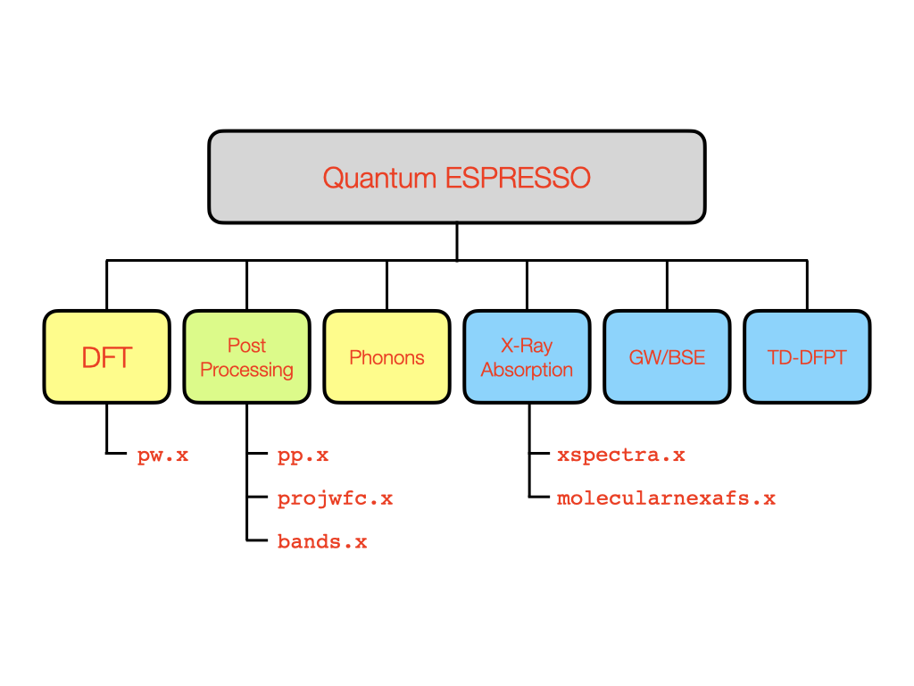
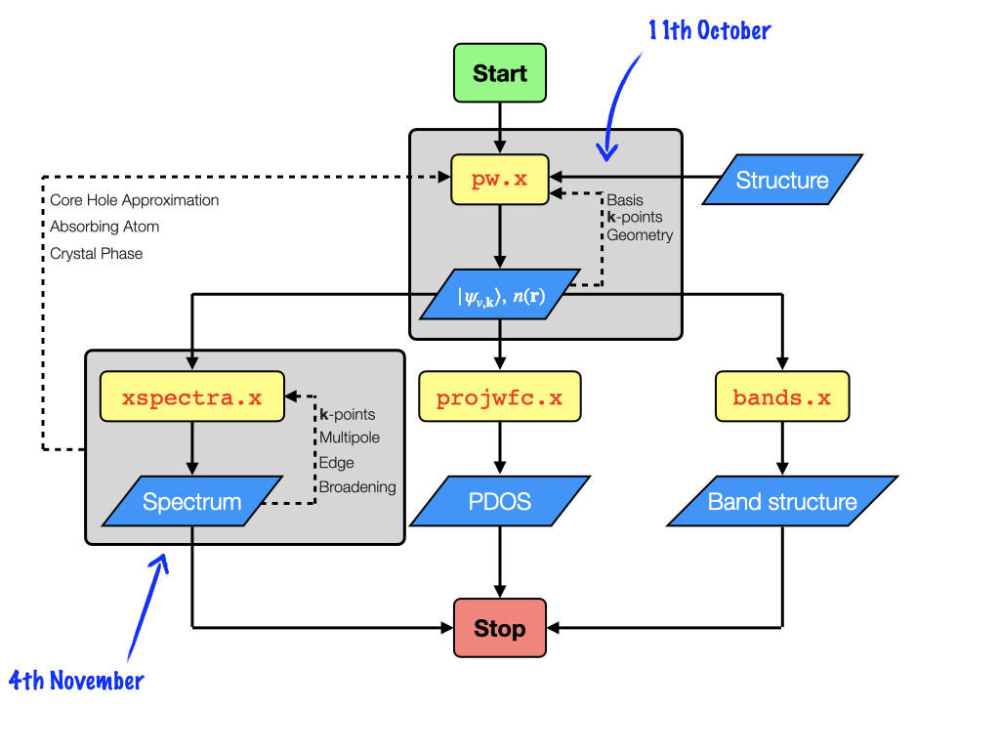
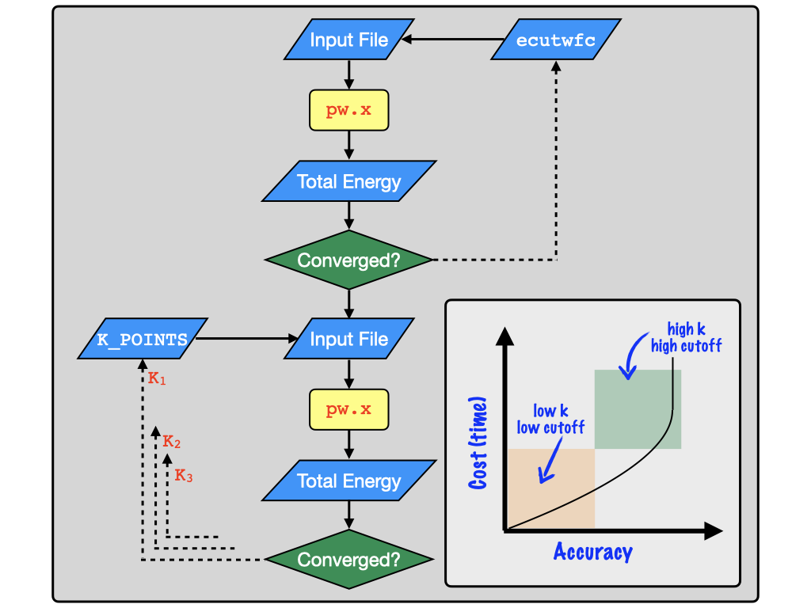

# Getting Started with <code>pw.x</code>

## New commands

| Command | Key Options | Description |
| ------- | ----------- | ----------- |
| <b>QE</b> |  |  |
<code>pw.x</code> | <code>-inp</code> <code>-npools</code> | Main executable for DFT in Quantum ESPRESSO |

## Introduction to X-Ray Spectroscopy in Quantum ESPRESSO

## The <code>pw.x</code> Input File

Now we can look at the input file, which will be read by the <code>pw.x</code>.
The input file is separated into a set of <code>Namelists</code> that must be presented in
order, followed by a series of <code>Cards</code>, which can be presented in any order.

Essentially the <code>Namelists</code> define the calculation and <code>Cards</code>
define the system we want to calculate.

There are potentially hundreds of individuals key words we might want to use to run our
calculations.
There is a complete overview of the input keywords and possible arguments available
[here](https://www.quantum-espresso.org/Doc/INPUT_PW.html). It is not required to provide
every keyword in the input file. First we will look at the most important ones:

The first <code>Namelist</code> is <code>&CONTROL</code>, which deals with <em>administrative</em>
variables. Quantum ESPRESSO is programmed in FORTRAN, so <code>!</code> can be used to
insert a comment.

    &CONTROL
       calculation = '' ! The type of job requested
       prefix      = '' ! The name of the files created
       outdir      = '' ! Where metadata is stored
       psuedodir   = '' ! The location of the pseudopotentials
       verbosity   = '' ! How detailed is the output from the code
    /

The second <code>Namelist</code> is the <code>&SYSTEM</code>, which describes the material being
calculated.

    &SYSTEM
       ibrav     = ! index of the bravais lattice
       celldm(1) = ! Lattice parameter in (Bohr Radius)
       nat       = ! Number of atoms
       ntyp      = ! Number of different Atomic types
       ecutwfc   = ! Energy cutoff applied to basis set
       nspin     = ! Spin polarization or non-collinear magnetism
    /

The third <code>Namelist</code> is <code>&ELECTRONS</code> which introduces keywords that control the
self consistency cycle.
Luckily in the first instance, we do not have to specify anything here, just declare the
<code>Namelist</code>

    &ELECTRONS
    /

For geometry optimisation, there is one further <code>Namelist</code> which controls the
optimisation of the ionic (nuclear) coordinates. Similar to the <code>&ELECTRONS</code>
<code>Namelist</code>, we don't have to provide any parameters at first.

    &IONS
    / 

After these <code>Namelists</code> in this order, we have to provide a set of
<code>Cards</code> that provides details on the system.
These <code>Cards</code> can be given in any order.

The first we will require is the <code>ATOMIC_SPECIES</code> Card.
This is a list of all of the different atom types used in the calculation.
Note that the same Atom can be given two different labels to distinguish between different
sites in a crystal. This is useful for instance in defining magnetically coupled elements
in anti-ferromagnetic materials.

The number of specicies listed in the <code>ATOMIC_SPECIES</code> <code>Card</code> should
be equal to <code>ntyp</code> set in the <code>&SYSTEM</code> <code>Namelist</code>

    ATOMIC_SPECIES
    label1 atomic_mass pseudopotential
    label2 atomic_mass pseudopotential

We also have to provide the coordinates of the atoms in the system.
These can be given to <code>pw.x</code> in xyz format in units of Angstrom, Bohr radius
and as a fraction of the lattice parameter.

    ATOMIC_POSITIONS {Unit}
    label1 x1 y1 z1
    label1 x2 y2 z2
    label1 x3 y3 z3
    label2 x4 y4 z4

If we do not use a prescribed Bravais lattice through the <code>ibrav</code> keyword in
the <code>&SYSTEM</code> <code>Namelist</code>, then we must provide details on the unit
cell. Similar to the atomic coordinates, the cell can be specified with units Angstrom,
Bohr radius and as a fraction of the lattice constant.

    CELL_PARAMETERS {Unit}
    a1 a2 a3
    b1 b2 b3
    c1 c2 c3

Lastly, we must describe the sampling of the reciprocal lattice. 
This is done using the <code>K_POINTS</code> <code>Card</code>.
For the standard DFT calculations we will do, it is best to use an automatically generated
Gamma centered grid

    K_POINTS {Automatic}
    k1 k2 k3 0 0 0

## Running <code>pw.x</code>

Lets put together an input file from scratch and run <code>pw.x</code> live.

## The <code>pw.x</code> Output File

## Pseudopotentials

# Optimization with <code>pw.x</code>

## Basis set optimization

First lets look at the first part of the optimization, which is the optimization of the
basis set.

To understand why we should do this optimisation we can look at what the basis set is

$$ \psi_i(\mathbf{r}) = \sum^\infty C_{i} \phi_{i}(\mathbf{r}) $$

## <b>k</b>-point Optimization 

## Conceptual Gotchas

### Systems that work out of the box

 - Bulk crystalline materials

### Systems that require care

 - Unpaired spins
 - Molecules
 - Surfaces
 - Neutral defects

### Systems that are challenging

 - Mott-Insulators
 - Molecules on surfaces
 - Solid-Liquid interfaces
 - Charged defects
 - Charged Molecules

### Systems that are really nasty

 - Charged surfaces
