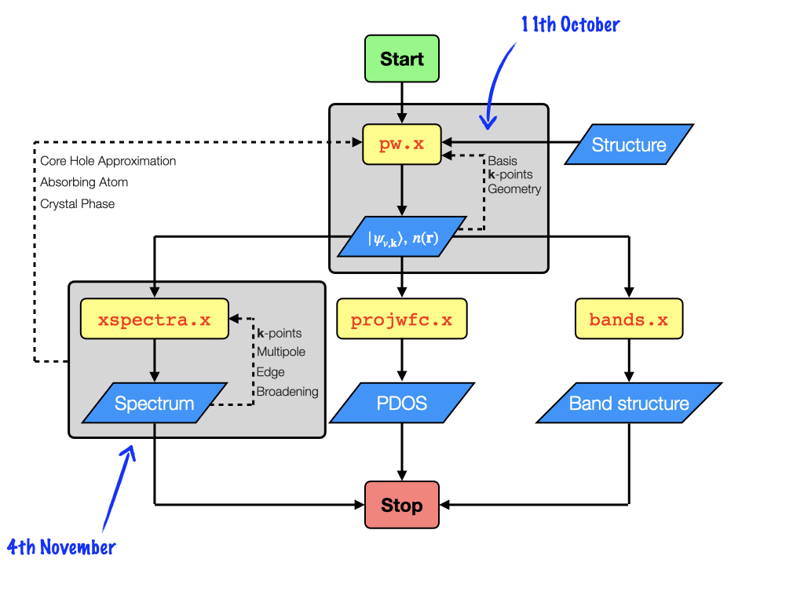

# New commands in this lecture

| <b>Command</b> | <b>Key Options</b> | <b>Description</b> |
|----------------|--------------------|--------------------|
| <code>xspectra.x</code> | | Quantum espresso code for XANES simulations |
| <code>gnuplot</code>    | | Commandline based application for plotting data | 

# Examples in this session:
The aim of this sessions is to learn and to build up experience using the <code>xspectra.x</code> package.
Specifically we will look at three seperate examples
- <b>Diamond</b>
   - The <code>xspectra</code> input file.
   - How to quickly plot results while on SCARF
   - Modifying the spectrum after its been calculated
   - Adding the effects of a core-hole
- <b>SiO2</b>
   - Factoring in crystal and polarization orientation
- <b>NiO</b>
   - Examples with spin-polarization/magnetization
   - Spectral broadening
   - Quadrupole transitions

We will need three terminal windows for these examples.
Two of them can be logged into scarf (one will be used for simulations the other for plotting results), the third will remain open on the nx server for visualization of any structures.

We can log in to SCARF, go to the work directory and copy the examples from the shared folder:

    $ ssh myfedid@ui1.scarf.rl.ac.uk
    $ cd myfedid
    $ cp -r /work4/dls/shared/introtoxspectra .

# Example 1: Diamond and the XSpectra input file

## Workflow for Xspectra calculation revisited

In the first example, we will look at diamond

    $ cd introtoxspectra/01_Diamond
    $ ls -ltrh
    total 120K
    -rw-r--r-- 1 scarf1097 diag 508 Nov 14 21:47 diamond.scf.in
    -rw-r--r-- 1 scarf1097 diag 470 Nov 14 21:47 diamond.xspectra.in
    -rw-r--r-- 1 scarf1097 diag 546 Nov 14 21:47 diamond.xspectra_replot.in
    -rw-r--r-- 1 scarf1097 diag 531 Nov 14 21:47 diamondh.scf.in
    -rw-r--r-- 1 scarf1097 diag 549 Nov 14 21:47 diamondh.xspectra.in

There are two sets of simulations contained in this folder: <code>diamond.\*</code> and <code>diamondh.\*</code>.
We will start with the <code>diamond.scf.in</code>, which is the input for <code>pw.x</code>

    $ cat diamond.scf.in
    &control
        calculation='scf',
        pseudo_dir = '../pseudopotentials'
        outdir='./TMP'
        prefix='diamond',
     /
     &system
        ibrav = 1,
        celldm(1) = 6.740256,
        nat=8,
        ntyp=2,
        nbnd=16,
        ecutwfc=40.0,
     /
     &electrons
        mixing_beta = 0.3,
     /
    ATOMIC_SPECIES
    C_h 12.0 C_PBE_TM_2pj.UPF
    C   12.0 C_PBE_TM_2pj.UPF

    ATOMIC_POSITIONS crystal
    C_h 0.0 0.0 0.0
    C 0.0 0.5 0.5
    C 0.5 0.0 0.5
    C 0.5 0.5 0.0
    C 0.75 0.75 0.25
    C 0.75 0.25 0.75
    C 0.25 0.75 0.75
    C 0.25 0.25 0.25

    K_POINTS automatic
    4 4 4 0 0 0

We can copy and visualize the structure locally using the <code>ase gui</code> from last time.

To run the DFT calculation, we can load the Quantum ESPRESSO modules, request resources with <code>salloc</code>, 
and call the <code>pw.x</code> executable.

    $ module load contrib/dls-spectroscopy/quantum-espresso/6.5-intel-18.0.3
    $ salloc -p scarf -C amd
    $ mpirun -np 1 pw.x -inp diamond.scf.in

Now that the SCF calculation is finished, lets look at the xspectra input file

    cat diamond.xspectra.in
    &input_xspectra
       calculation='xanes_dipole',
       prefix='diamond',
       outdir='./TMP'
       xniter=1000,
       xcheck_conv=50,
       xepsilon(1)=1.0,
       xepsilon(2)=0.0,
       xepsilon(3)=0.0,
       xiabs=1,
       x_save_file='diamond.xspectra.sav',
       xerror=0.001,
    /
    &plot
       xnepoint=300,
       xgamma=0.8,
       xemin=-10.0,
       xemax=30.0,
       terminator=.true.,
       cut_occ_states=.false.,
    /
    &pseudos
       filecore='C.wfc',
       r_paw(1)=3.2,
    /
    &cut_occ
    /
    4 4 4 1 1 1

## XSpectra Namelists

The first thing to notice is that the format of the <code>xspectra.x</code>  input file is the same as the <code>pw.x</code>
input file.

There are <code>NAMELISTS</code>, which must be provided in order and one <code>CARD</code>. 
The first <code>NAMELIST</code> is <code>&INPUT_XSPECTRA</code> which provides information on the 
location of the ground state calculation, and controls the function of the <code>xspectra.x</code>calculation.
In this way, it is analagous to the <code>&CONTROL</code> namelist, and even shares some keywords:

<code>&INPUT_XSPECTRA</code>

    &input_xspectra
       calculation  = ! like pw.x, the type of calculation to be run (xanes_dipole, xanes_quadrupole)
       prefix       = ! like pw.x, the name of all the metadata files to be created
       outdir       = ! like pw.x, the location of all of the simulation files
       xniter       = ! the maximum number of iterations to reach convergence
       xcheck_conv  = ! how often to check whether spectrum is converged
       xepsilon(1)  = ! projection of the polarization vector
       xepsilon(2)  = !
       xepsilon(3)  = !
       xiabs        = ! index corresponding to the absorbing atom in pw.x simulation
       x_save_file  = ! name of file where xspectra metadata is written
       xerror       = ! convergence threshold
    /

The second namelist is <code>&PLOT</code> which controls the final plot of the xanes spectrum.

    &plot
       xnepoint        = ! number of points in plot (energy resolution)
       xgamma          = ! spectral broadening related to core-hole lifetime
       xemin           = ! minimum energy of the spectrum
       xemax           = ! maximum energy of the spectrum
       terminator      = ! use a function to improve convergence
       cut_occ_states  = ! include/ remove occupied states from the spectrum
    /

The third namelist is <code>&PSEUDOS</code>. This namelist tells <code>xspectra.x</code> where to read the core wavefunction (initial state) from,
and how to reconstruct the core levels.

    &pseudos
       filecore   = ! File that contains the atomic core wavefunction (initial state)
       r_paw(1)   = ! radius of the wavefunction reconstructed from projector augmented wavein l=1
       r_paw(2)   = ! as above for l=2
    /

Finally, there is the <code>&CUT_OCC</code> Namelist which helps to smoothly remove occupied states from the spectrum when <code>cut_occ_states=.TRUE.</code> in the <code>&PLOT</code> namelist.

## Running XSpectra

Typically, before we run the xspectra calculation we will have to extract the core wavefunction <code>filecore</code> from the pseudopotential we are using for the ground state DFT calculation.
For future reference, this should always be the pseudopotential without a core-hole (since the excitation originates from a ground state wavefunction). 
Luckily there is a bash script <code>upf2plotcore.sh</code>, distributed with XSpectra we can use.
A version of the script is included in the lectrure material.

    $ ../tools/upf2plotcore.sh ../pseudopotentials/C_PBE_TM_2pj.UPF > C.wfc
 
We can plot the wavefunction file to make sure it makes sense, for this we will need to <code>ssh</code> to scarf with <code>x11</code> forwarding

    $ ssh -Y myfedid@ui1.scarf.rl.ac.uk
    $ cd myfedid/introtoxspectra/01_Diamond
    $ gnuplot
    gnuplot> plot 'C.wfc'
    gnuplot> set xrange [0:5]
    gnuplot> replot

If executed correctly should see a plot of the C 1s wavefunction.

Now we can use the <code>xspectra.x</code> code to run the <code>diamond.xspectra.in</code>

    $ mpirun -np 1 xspectra.x -inp diamond.xspectra.in
        ...

        The spectrum is calculated using the following parameters:
        energy-zero of the spectrum [eV]:   13.3353
        the occupied states are NOT eliminated from the spectrum
        xemin [eV]: -10.00
        xemax [eV]:  30.00
        xnepoint:  300
        constant broadening parameter [eV]:    0.800
        Core level energy [eV]:  -284.2    
         (from electron binding energy of neutral atoms in X-ray data booklet)

Unlike <code>pw.x</code>, the output of <code>xspectra.x</code> is significantly less interesting to look at.
Provided that the (Lanczos) minimization algorithm manages to converge, the end of the <code>xspectra.x</code> will print some information about the spectrum.

The spectrum is plotted (by default) in a new file called <code>xanes.dat</code>. Depending on the version of Quantum ESPRESSO, it is possible to set the name of this file in the input file.
In Quantum ESRESSO Version > 7.0 this can be achieved with the keyword <code>xanes_file</code> in the <code>&PLOT</code> namelist.

     $ ls -ltrh
     -rw-r--r-- 1 scarf1097 diag 8.7K Nov 14 11:28 xanes.dat

Lets inspect the spectrum that has been calculated:
Since we are using version 6.7 we can manually rename and plot the xanes spectrum with the <code>mv</code> command and plot with <code>gnuplot</code>

     $ mv xanes.dat xanes_no_corehole.dat
     $ gnuplot
     gnuplot> plot 'xanes_no_corehole.dat'

XSpectra does not calculate absolute transition energies, rather the spectrum zero is set to the system Fermi level. 
This means that at the low energy (less than zero) part of the spectrum we see features that should not be there,
these correspond to transitions to the filled orbitals.

We can smoothly remove the contribution of these transitions from the spectrum using the <code>xplot_only</code> keyword in the <code>&INPUT_XSPECTRA</code> namelist
and the <code>cut_occ_states</code> keyword in the <code>&PLOT</code> namelist.

A key feature here is that once the spectrum has been computed, the information to contstruct it is contained within the <code>x_save_file</code>.

The option <code>xonly_plot</code> instructs the code to skip over the computationally heavy tasks.

    $ cat diamond.xspectra_replot.in 
    &input_xspectra
       calculation='xanes_dipole',
       prefix='diamond',
       outdir='./TMP'
       xonly_plot=.true., ! Do not perform the calculation, read results from saved file
       xniter=1000,
       xcheck_conv=50,
       xepsilon(1)=1.0,
       xepsilon(2)=0.0,
       xepsilon(3)=0.0,
       xiabs=1,
       x_save_file='diamond.xspectra.sav',
       ef_r=,
       xerror=0.001,
    /
    &plot
       xnepoint=1000,
       xgamma=0.8,
       xemin=-10.0,
       xemax=30.0,
       terminator=.true.,
       cut_occ_states=.true., ! Cut occupied states from final spectrum
    /
    &pseudos
       filecore='C.wfc',
       r_paw(1)=3.2,
    /
    &cut_occ
       cut_desmooth=0.1,
       cut_stepl=0.01,
    /
    4 4 4 1 1 1

Run <code>xspectra.x</code> again

    $ mpirun -np 1 xspectra.x -inp diamond.xspectra_replot.in
        Using the following parameters:
        energy-zero of the spectrum [eV]:   13.3353
        the occupied states are elimintate from the spectrum ***
        xemin [eV]: -10.00
        xemax [eV]:  30.00
        xnepoint: 1000
        constant broadening parameter [eV]:    0.800
        Core level energy [eV]:  -284.2    
         (from electron binding energy of neutral atoms in X-ray data booklet)

     Cross-section successfully written in xanes.dat 

Again, we can move the new <code>xanes.dat</code> file manually and plot a comparison of the two spectra we have computed.

     $ mv xanes.dat xanes_no_corehole_no_occ_states.dat
     $ gnuplot
     gnuplot> plot 'xanes_no_corehole.dat'; replot 'xanes_no_corehole_no_occ_states.dat'

What should be clear from the plot, is that the occupied states have now been removed from the spectrum and we are left with the theoretical XANES.

The XANES that we have calculated corresponds to the transition from an atomic core level to an unperturbed empty manifold states.
In reality, the creation of the excitation will renormalise all of the energy levels of the bands/orbitals resulting in different absorption energies and intensities.

We can attempt to account for this modification of the electronic structure by including a potential that looks like a hole in the core orbital.
This is the so-called core-hole approximation.

For this we use a pseudopotential which has been created with the electronic configuration 1<em>s</em>1. 
Note that in practice, we should generate these hole containing pseudopotentials ourselves, but this is not always the easiest thing to do.
Here instead we will make use of the pseudopotential <code>Ch_PBE_TM_2pj.UPF</code> which has a core-hole included.

    $ cat diamondh.scf.in 
    &control
       calculation='scf',
       pseudo_dir = '../pseudopotentials'
       outdir='./TMP'
       prefix='diamondh',
    /
    &system
       ibrav = 1,
       celldm(1) = 6.740256,
       nat=8,
       ntyp=2,
       nbnd=16,
       tot_charge=+1.0,  ! Charged simulation cell due to core-hole
       ecutwfc=40.0,
    /
    &electrons
       mixing_beta = 0.3,
    /
    ATOMIC_SPECIES
    C_h 12.0 Ch_PBE_TM_2pj.UPF ! PP with core hole
    C 12.0 C_PBE_TM_2pj.UPF
    ATOMIC_POSITIONS crystal
    C_h 0.0 0.0 0.0
    C 0.0 0.5 0.5
    C 0.5 0.0 0.5
    C 0.5 0.5 0.0
    C 0.75 0.75 0.25
    C 0.75 0.25 0.75
    C 0.25 0.75 0.75
    C 0.25 0.25 0.25
    K_POINTS automatic
    4 4 4 0 0 0

The core-hole calculation requires a new dft calculation with the <code>pw.x</code>

    $ mpirun -np 1 pw.x -inp diamondh.scf.in 
    
And if we look at the <code>xspectra</code> file we see that not much changes

    $ cat diamondh.xspectra.in
    &input_xspectra
       calculation='xanes_dipole',
       prefix='diamondh',
       outdir='./TMP'
       xonly_plot=.false.,
       xniter=1000,
       xcheck_conv=10,
       xepsilon(1)=1.0,
       xepsilon(2)=0.0,
       xepsilon(3)=0.0,
       xiabs=1,
       x_save_file='diamondh.xspectra.sav',
       ef_r=,
       xerror=0.001,
    /
    &plot
       xnepoint=1000,
       xgamma=0.8,
       xemin=-10.0,
       xemax=30.0,
       terminator=.true.,
       cut_occ_states=.true.,
    /
    &pseudos
       filecore='C.wfc',
       r_paw(1)=3.2,
    /
    &cut_occ
       cut_desmooth=0.1,
       cut_stepl=0.01,
    /
    4 4 4 1 1 1

The option <code>xonly_plot</code> has been set to <code>.FALSE.</code> because we must recompute the elements of the spectrum.
We can run, plot and inspect the result of this <code>xspectra.x</code> simulation

    $ mpirun -np 1 xspectra.x -inp diamondh.xspectra.in
    $ mv xanes.dat xanes_corehole_no_occ_states.dat
    $ gnuplot
    gnuplot> plot 'xanes_corehole_no_occ_states.dat'; replot 'xanes_no_corehole_no_occ_states.dat'

In this example, the effect of the core-hole is very large.

# Example of polarization SiO2

    $ cat SiO2.scf.in
    &control
       calculation='scf',
       restart_mode='from_scratch',
       pseudo_dir = '../pseudopotentials'
       outdir='./TMP'
       prefix='SiO2',
       verbosity = 'high',
    /
    &system
       ibrav = 4 ,
       celldm(1)=9.28630318961333,
       celldm(3)=1.10010,
       nat = 9 ,
       ntyp = 3 ,
       nspin=1,
       ecutwfc = 20.0,
       ecutrho = 150.0,
       nbnd=30,
       smearing='mp',
       occupations='smearing',
       degauss=0.03,
    /
    &electrons
       diagonalization='david',
       conv_thr = 1.d-9,
       mixing_mode = 'plain',
       mixing_beta = 0.3,
    /
    
    ATOMIC_SPECIES
    Sih   28.086 Si_PBE_USPP.UPF
    Si   28.086 Si_PBE_USPP.UPF
    O  15.9994   O_PBE_USPP.UPF
    
    ATOMIC_POSITIONS crystal
    Sih 0.47000000000000 0.000000000000 0.00000000000000
    Si 0.00000000000000 0.47000000000000 0.6666666666666666
    Si -0.47000000000000 -0.47000000000000 0.333333333333333
    O 0.4131000000000000 0.267700000000000 0.11890000000000
    O 0.267700000000000 0.4131000000000000 .54776666666666666666
    O -0.267700000000000 0.1454000000000000 .78556666666666666666
    O -0.4131000000000000 -0.1454000000000000 .21443333333333333333
    O -0.1454000000000000 -0.4131000000000000 .45223333333333333333
    O 0.1454000000000000 -0.267700000000000 -0.11890000000000
    
    K_POINTS automatic
    2 2 2 0 0 0

    $ cat SiO2.xspectra_dip_plane.in 
    &input_xspectra
       calculation='xanes_dipole'
       prefix='SiO2',
       outdir='./TMP'
       xonly_plot=.false.,
       xniter=2000,
       xcheck_conv=50,
       xepsilon(1)=1.0,
       xepsilon(2)=1.0,
       xepsilon(3)=0.0,
       xiabs=1,
       x_save_file='SiO2.xspectra_dip_plane.sav',
       xerror=0.001,
       xe0=0.60294618180436781,
    / 

    &plot
       xnepoint=1000,
       xgamma=0.8,
       xemin=-10.0,
       xemax=100.0,
       terminator=.true.,
       cut_occ_states=.true.,
    /

    &pseudos
       filecore='Si.wfc',
       r_paw(1)=2.4,
    /

    &cut_occ
       cut_desmooth=0.1,
    /
    3 3 3 0 0 0

    $ ../tools/upf2plotcore.sh ../pseudopotentials/Si_PBE_USPP.UPF > Si.wfc 

    $ mpirun -np 1 xspectra.x -inp SiO2.xspectra_dip_plane.in
    $ mv xanes.dat xanes_inplane.dat
    $ gnuplot
    gnuplot> plot 'xanes_inplane.dat'
    
    $ cat SiO2.xspectra_dip_c.in 
    &input_xspectra
       calculation='xanes_dipole'
       prefix='SiO2',
       outdir='./TMP'
       xonly_plot=.false.,
       xniter=2000,
       xcheck_conv=50,
       xepsilon(1)=0.0,
       xepsilon(2)=0.0,
       xepsilon(3)=1.0,   ! Polarization in orthogonal direction
       xiabs=1,
       x_save_file='SiO2.xspectra_dip_c.sav',
       xerror=0.001,
       xe0=0.60294618180436781,
    /

    &plot
       xnepoint=1000,
       xgamma=0.8,
       xemin=-10.0,
       xemax=100.0,
       terminator=.true.,
       cut_occ_states=.true.,
    /

    &pseudos
       filecore='Si.wfc',
       r_paw(1)=2.4,
    /

    &cut_occ
       cut_desmooth=0.1,
    /
    3 3 3 0 0 0

    $ mv xanes.dat xanes_c.dat
    $ gnuplot
    $ gnuplot> plot 'xanes_inplane.dat' w l lw 3; replot 'xanes_c.dat' w l lw 3

# Magnetisim and NiO

    $ cat NiO.scf.in
    &control
        calculation='scf',
        pseudo_dir = '../pseudopotentials'
        outdir='./TMP'
        prefix='NiO',
     /

    &system
       ibrav = 5 ,
       celldm(1) =9.67155,
       celldm(4)=0.8333333333,
       nat = 4 ,
       ntyp = 3 ,
       nspin=2,
       ecutwfc = 70.0,
       starting_magnetization(1)=1.0,
       starting_magnetization(2)=-1.0,
       tot_magnetization = 0.0
       nbnd=24,
       lda_plus_u=.true.,
       Hubbard_U(1)=7.6,
       Hubbard_U(2)=7.6,
    /

    &electrons
       mixing_beta = 0.3,
    /

    ATOMIC_SPECIES
    Ni 58.6934   Ni_PBE_TM_2pj.UPF
    NiB  58.6934   Ni_PBE_TM_2pj.UPF
    O  15.9994   O_PBE_TM.UPF

    ATOMIC_POSITIONS crystal
    Ni  0.0000000000  0.0000000000  0.0000000000
    NiB  -.5000000000  1.5000000000  -.5000000000
    O  0.7500000000  -.2500000000  -.2500000000
    O  -.7500000000  0.2500000000  0.2500000000

    K_POINTS automatic
    1 1 1 0 0 0

    $ cat NiO.xspectra_dip.in
    &input_xspectra
       calculation='xanes_dipole',
       prefix='NiO',
       outdir='./TMP'
       xniter=1000,
       xcheck_conv=50,
       xepsilon(1)=1.0,
       xepsilon(2)=0.0,
       xepsilon(3)=0.0,
       xiabs=1,
       x_save_file='NiO.xspectra_dip.sav',
       xerror=0.001,
    /
    &plot
       xnepoint=300,
       xgamma=0.8,
       xemin=-10.0,
       xemax=20.0,
       terminator=.true.,
       cut_occ_states=.true.,
    /
    &pseudos
       filecore='Ni.wfc',
       r_paw(1)=1.5,
    /
    &cut_occ
       cut_desmooth=0.1,
    /
    2 2 2 0 0 0

    $ ../tools/upf2plotcore.sh ../pseudopotentials/Ni_PBE_TM_2pj.UPF > Ni.wfc
    $ mpirun -np 1 xspectra.x -inp NiO.xspectra_dip.in
    $ mv xanes.dat xanes_dip_gamma_1.5.dat
    $ mpirun -np 1 xspectra.x -inp NiO.xspectra_dip_replot.in
    $ mv xanes.dat xanes_dip_gamma_0.8.dat
    $ gnuplot
    gnuplot> plot 'xanes_dip_gamma_1.5.dat' w l lw 3; replot 'xanes_dip_gamma_0.8.dat' w l lw 3

    $ cat cat NiO.xspectra_qua.in 
    &input_xspectra
       calculation='xanes_quadrupole',
       prefix='NiO',
       outdir='./TMP'
       xniter=1000,
       xcheck_conv=50,
       xepsilon(1)=1.0,
       xepsilon(2)=-1.0,
       xepsilon(3)=0.0,
       xkvec(1)=1.0,
       xkvec(2)=1.0,
       xkvec(3)=-1.0,
       xiabs=1,
       x_save_file='NiO.xspectra_qua.sav',
       xerror=0.001,
    /
    &plot
       xnepoint=300,
       xgamma=0.8,
       xemin=-10.0,
       xemax=20.0,
       terminator=.true.,
       cut_occ_states=.true.,
    /
    &pseudos
       filecore='Ni.wfc',
       r_paw(2)=1.5,
    /
    &cut_occ
       cut_desmooth=0.1,
    /
    2 2 2 0 0 0

    $ mv xanes.dat xanes_quad_gamma_1.5.dat
    $ gnuplot
    gnuplot> plot 'xanes_dip_gamma_1.5.dat' w l lw 3; replot 'xanes_quad_gamma_1.5.dat' u 1:($2*15) w l lw 3

